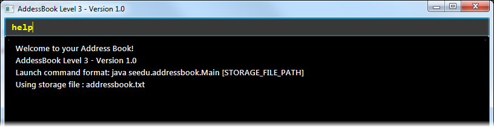

# AddressBook (Level 3)

* This is a CLI (Command Line Interface) Address Book application **written in OOP fashion**. It has a very basic GUI.
* It is a Java sample application intended for students learning Software Engineering while using Java as 
  the main programming language. 
* It provides a **reasonably well-written** code example that is **significantly bigger** than what students 
  usually write in data structure modules. 
  
**What's different from level 2**

* A simple GUI added to replace the Text UI.
* A `Logic` class added together with a `LogicTest` class.
* Appendices added to [Developer Guide](doc/DeveloperGuide.md).

  
**Useful Links**
* [User Guide](doc/UserGuide.md) 
* [Developer Guide](doc/DeveloperGuide.md) 
* [Learning Outcomes](doc/LearningOutcomes.md) 

# Contributors

* [Damith C. Rajapakse](http://www.comp.nus.edu.sg/~damithch) : Project Advisor
* [Leow Yijin](http://github.com/yijinl): Developer
* [Martin Choo](http://github.com/m133225): Developer
* [You Liang](http://github.com/yl-coder) : Developer 

# Acknowledgements

Some parts of this sample application was inspired by the excellent 
[Java FX tutorial](http://code.makery.ch/library/javafx-8-tutorial/) by Marco Jakob 

# Contact Us

* **Bug reports, Suggestions** : Post in our [issue tracker](https://github.com/se-edu/addressbook-level3/issues)
  if you noticed bugs or have suggestions on how to improve.
* **Contributing** : We welcome pull requests. Follow the process described [here](https://github.com/oss-generic/process)
