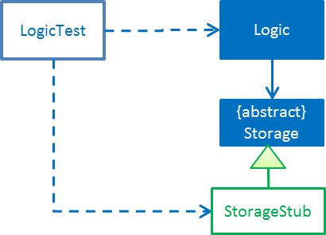

# Learning Outcomes
After studying this code and completing the corresponding exercises, you should be able to,

1. [Utilize User Stories `[LO-UserStories]`](#utilize-user-stories-lo-userstories)
1. [Utilize use cases `[LO-UseCases]`](#utilize-use-cases-lo-usecases)
1. [Use Non Functional Requirements `[LO-NFR]`](#use-non-functional-requirements-lo-nfr)
1. [Use Polymorphism `[LO-Polymorphism]`](#use-polymorphism-lo-polymorphism)
1. [Use abstract classes/methods `[LO-Abstract]`](#use-abstract-classesmethods-lo-abstract)
1. [Use interfaces `[LO-Interfaces]`](#use-interfaces-lo-interfaces)
1. [Follow Liskov Substitution Principle `[LO-LSP]`](#follow-liskov-substitution-principle-lo-lsp)
1. [Use Java-FX for GUI programming `[LO-JavaFx]`](#use-java-fx-for-gui-programming-lo-javafx)
1. [Analyze Coupling and Cohesion of designs `[LO-CouplingCohesion]`](#analyze-coupling-and-cohesion-of-designs-lo-couplingcohesion)
1. [Apply Dependency Inversion Principle `[LO-DIP]`](#apply-dependency-inversion-principle-lo-dip)
1. [Use Dependency Injection `[LO-DI]`](#use-dependency-injection-lo-di)
1. [Apply Open-Closed Principle `[LO-OCP]`](#apply-open-closed-principle-lo-ocp)
1. [Work in a 3KLoC code base `[LO-3KLoC]`](#work-in-a-3kloc-code-base-lo-3kloc)

------------------------------------------------------------------------------------------------------

## Utilize User Stories `[LO-UserStories]`

#### References

* [se-edu/se-book: Requirements: Specifying Requirements: User Stories](https://se-edu.github.io/se-book/specifyingRequirements/userStories/) 
  
#### Exercise: Add more user stories 

* Assume you are planing to expand the functionality of the AddressBook (but keep it as a CLI application).
  What other user stories do you think AddressBook should support? Add those user stories to the `DeveloperGuide.md`. 

------------------------------------------------------------------------------------------------------

## Utilize use cases `[LO-UseCases]`

#### References

* [se-edu/se-book: Requirements: Specifying Requirements: Use Cases](https://se-edu.github.io/se-book/specifyingRequirements/useCases/) 

#### Exercise: Add a 'Rename tag' use case 
* Add a use case to the `DeveloperGuide.md` to cover the case of *renaming of an existing tag*.<br> 
  e.g. rename the tag `friends` to `buddies` (i.e. all persons who had the `friends` tag will now have 
  a `buddies` tag instead)<br>
  Assume that AddressBook confirms the change with the user before carrying out the operation. 

------------------------------------------------------------------------------------------------------

## Use Non Functional Requirements `[LO-NFR]`

#### References

* [se-edu/se-book: Requirements: Non-Functional Requirements](https://se-edu.github.io/se-book/requirements/nonFunctionalRequirements/) 

#### Exercise: Add more NFRs 

* Add some more NFRs to the `DeveloperGuide.md`

------------------------------------------------------------------------------------------------------

## Use Polymorphism `[LO-Polymorphism]`

Note how the `Command::execute()` method shows polymorphic behavior.

#### References

* [se-edu/se-book: Implementation: OOP: Polymorphism](https://se-edu.github.io/se-book/oopImplementation/polymorphism/) 

#### Exercise: Add a polymorphic `isMutating` method 

* Add a method `boolean isMutating()` to the `Command` class. This method will return `true` for
  command types that mutate the data. e.g. `AddCommand`
* Currently, AddressBook data are saved to the file after every command. 
  Take advantage of the the new method you added to limit file saving to only for command types that mutate data.<br>
  i.e. `add` command should always save the data while `list` command should never save data to the file.

Note: There may be better ways to limit file saving to commands that mutate data. The above approach, while not
 optimal, will give you chance to implement a polymorphic behavior.  

------------------------------------------------------------------------------------------------------

## Use abstract classes/methods `[LO-Abstract]`

#### References

* [se-edu/se-book: Implementation: OOP: Abstract Classes](https://se-edu.github.io/se-book/oopImplementation/abstractClasses/) 

#### Exercise: Make `Command#execute()` method abstract

* Make the `Command#execute()` method abstract (hint: refer to the comment given below the method)

------------------------------------------------------------------------------------------------------

## Use interfaces `[LO-Interfaces]`

Note how the `Person` class implements the `ReadOnlyPerson` interface so that clients who don't need write access to `Person` objects can access `Person` objects through the `ReadOnlyPerson` interface instead.


#### References

* [se-edu/se-book: Implementation: OOP: Abstract Interfaces](https://se-edu.github.io/se-book/oopImplementation/interfaces/) 

##### Exercise: Add a `Printable` interface 

* Add a `Printable` interface as follows.<br>
  
* `Override` the `getPrintableString` in classes `Name`, `Phone`, `Email`, and `Address` so that each produces a printable string representation of the object. e.g. `Name: John Smith`, `Phone: 12349862`
* Add the following method in a suitable place of some other class. Note how the method depends on the Interface.
  
  ```java
  /**
    * Returns a concatenated version of the printable strings of each object.
    */
  String getPrintableString(Printable... printables){
  ```
  
  The above method can be used to get a printable string representing a bunch of person details. 
  For example, you should be able to call that method like this:
  
  ```java
  //p is a Person object
  return getPrintableString(p.getPhone(), p.getEmail(), p.getAddress()); 
  ```

------------------------------------------------------------------------------------------------------

## Follow Liskov Substitution Principle `[LO-LSP]`

#### References

* [se-edu/se-book: Principles: Liskov Substitution Principle](https://se-edu.github.io/se-book/principles/liskovSubstitutionPrinciple/) 

#### Exercise: Add an exception to an overridden method

* Add a `throws Exception` clause to the `AddCommand::execute` method. Notice how Java compiler will not allow it,
  unless you add the same `throws` clause to the parent class method. This is because if a child class throws
  an exception that is not specified by the Parent's contract, the child class is no longer substitutable in place of 
  the parent class.
* Also note that while in the above example the compiler enforces LSP, there are other situations where it is up to
  the programmer to enforce it. For example, if the method in the parent class works for `null` input, the overridden
  method in the child class should not reject `null` inputs. This will not be enforced by the compiler.
  
------------------------------------------------------------------------------------------------------

## Use Java-FX for GUI programming `[LO-JavaFx]`

#### References

* [se-edu/se-book: Tools: Java: JavaFX: Basic](https://se-edu.github.io/se-book/javaTools/javaFXBasic/)

#### Exercise: Enhance GUI

* Do some enhancements to the AddressBook GUI. e.g. add an application icon, change font size/style 
  
------------------------------------------------------------------------------------------------------

## Analyze Coupling and Cohesion of designs `[LO-CouplingCohesion]`

* Notice how having a separate `Formattter` class (an application of the Single Responsibility Principle) improves the *cohesion* of the `MainWindow` class as well as the `Formatter` class.

#### References

* [se-edu/se-book: Design: Design Principles: Coupling](https://se-edu.github.io/se-book/designPrinciples/coupling/) 
* [se-edu/se-book: Design: Design Principles: Cohesion](https://se-edu.github.io/se-book/designPrinciples/cohesion/) 

#### Exercise: Identify places to reduce coupling and increase cohesion

* Where else in the design coupling can be reduced further, or cohesion can be increased further?

------------------------------------------------------------------------------------------------------

## Apply Dependency Inversion Principle `[LO-DIP]`

#### References

* [se-edu/se-book: Principles: Dependency Inversion Principle](https://se-edu.github.io/se-book/principles/dependencyInversionPrinciple/) 

#### Exercise: Invert dependency from Logic to Storage

* Note how `Logic` class depends on the `StorageFile` class. This is a violation of DIP.
* Modify the implementation as follows so that both `Logic` and `StorageFile` now depend on the
  `abstract` class `Storage`. <br>
  
* Where else in the code do you notice the application of DIP?

------------------------------------------------------------------------------------------------------

## Use Dependency Injection `[LO-DI]`

Note how `Logic` class depends on the `StorageFile` class. This means when testing the `Logic` class,
our test cases execute the `StorageFile` class as well. What if we want to test the `Logic` class without
getting the `StorageFile` class involved? That is a situation where we can use *Dependency Injection*.

#### References

* [se-edu/se-book: Quality Assurance: Testing: Dependency Injection](https://se-edu.github.io/se-book/testing/dependencyInjection/) 

#### Exercise: Facilitate injecting a StorageStub

* Change the implementation as follows so that we can inject a `StorageStub` when testing the `Logic`
  class. <br>
  
  
  > If you did the exercise in [`LO-DIP`](#apply-dependency-inversion-principle-lo-dip)
    already but those changes are in a different branch, you may be able to reuse some of those commits 
    by cherry picking them from that branch to the branch you created for this exercise. <br>
    Note: *cherry picking* is simply copy-pasting a commit from one branch to another. In SourceTree, you can 
    right-click on the commit your want to copy to the current branch, and choose 'Cherry pick'
* Implement the `StorageStub` such that calls to the `save` method do nothing (i.e. empty method body).   
* Update the `LogicTest` to work with the `StorageStub` instead of the actual `StorageFile` object. <br>
  i.e. `Logic` injects a `StorageStub` object to replace the dependency of `Logic` on `StorageFile` before 
   testing `Logic`.
* The example above uses [DIP](#apply-dependency-inversion-principle-lo-dip) as a means to achieve DI.
  Note that there is another way to inject a `StorageStub` object, as shown below.
  In this case we do not apply the DIP but we still achieve DI.<br>
  

------------------------------------------------------------------------------------------------------

## Apply Open-Closed Principle `[LO-OCP]`

#### References
* [se-edu/se-book: Design: Desing Principles: Open-Closed Principle](https://se-edu.github.io/se-book/designPrinciples/openClosedPrinciple/) 

#### Exercise: Analyze OCP-compliance of the `Logic` class

* Consider adding a new command to the Address Book. e.g. an `edit` command. Notice how little you need to change in the `Logic` class to extend its behavior so that it can execute the new command.
  That is because `Logic` follows the OCP i.e. `Logic` is *open to be extended* with more commands but *closed for modifications*.
* Is it possible to make the `Parser` class more OCP-compliant in terms of extending it to handle more 
  command types?
* In terms of how it saves data, does `Logic` become more OCP-compliant
  after applying DIP as given in [`LO-DIP`](#apply-dependency-inversion-principle-lo-dip)? 
  How can you improve `Logic`'s OCP-compliance further so that it can not only work with different types
  of storages, but different number of storages (e.g. save to both a text file and a database).

------------------------------------------------------------------------------------------------------

## Work in a 3KLoC code base `[LO-3KLoC]`

#### Exercise: Enhance AddressBook

* Enhance AddressBook in some way. e.g. add a new command

------------------------------------------------------------------------------------------------------

