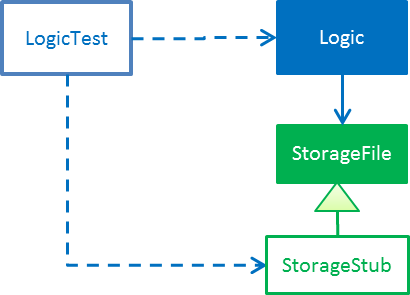
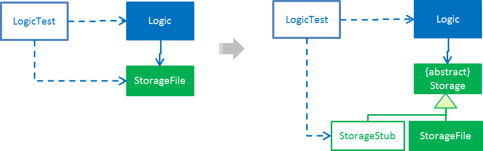

# Learning Outcomes
After studying this code and completing the corresponding exercises, you should be able to,

1. [Utilize User Stories `[LO-UserStories]`](#utilize-user-stories-lo-userstories)
1. [Utilize use cases `[LO-UseCases]`](#utilize-use-cases-lo-usecases)
1. [Use Non Functional Requirements `[LO-NFR]`](#use-non-functional-requirements-lo-nfr)
1. [Use Polymorphism `[LO-Polymorphism]`](#use-polymorphism-lo-polymorphism)
1. [Use abstract classes/methods `[LO-Abstract]`](#use-abstract-classesmethods-lo-abstract)
1. [Follow Liskov Substitution Principle `[LO-LSP]`](#follow-liskov-substitution-principle-lo-lsp)
1. [Use Java-FX for GUI programming `[LO-JavaFx]`](#use-java-fx-for-gui-programming-lo-javafx)
1. [Apply Dependency Inversion Principle `[LO-DIP]`](#apply-dependency-inversion-principle)
1. [Use Dependency Injection `[LO-DI]`](#use-dependency-injection)
1. [Apply Open-Closed Principle `[LO-OCP]`](#apply-open-closed-principle)

------------------------------------------------------------------------------------------------------

## Utilize User Stories `[LO-UserStories]`
  
#### Exercise: Add more user stories 

* Assume you are planing to expand the functionality of the AddressBook (but keep it as a CLI application).
  What other user stories do you think AddressBook should support? Add those user stories to the `DeveloperGuide.md`. 

------------------------------------------------------------------------------------------------------

## Utilize use cases `[LO-UseCases]`

#### Exercise: Add a 'Rename tag' use case 
* Add a use case to the `DeveloperGuide.md` to cover the case of *renaming of an existing tag*.  
  e.g. rename the tag `friends` to `buddies` (i.e. all persons who had the `friends` tag will now have 
  a `buddies` tag instead) 
  Assume that AddressBook confirms the change with the user before carrying out the operation. 

------------------------------------------------------------------------------------------------------

## Use Non Functional Requirements `[LO-NFR]`

#### Exercise: Add more NFRs 

* Add some more NFRs to the `DeveloperGuide.md`

------------------------------------------------------------------------------------------------------

## Use Polymorphism `[LO-Polymorphism]`

Note how the `Command::execute()` method shows polymorphic behavior. 

#### Exercise: Add a polymorphic `isMutating` method 

* Add an `abstract` method `boolean isMutating()` to the `Command` class. This method will return `true` for
  command types that mutate the data. e.g. `AddCommand`
* Currently, AddressBook data are saved to the file after every command. 
  Take advantage of the the new method you added to limit file saving to only for command types that mutate data. 
  i.e. `add` command should always save the data while `list` command should never save data to the file.

Note: There may be better ways to limit file saving to commands that mutate data. The above approach, while not
 optimal, will give you chance to implement a polymorphic behavior.  

------------------------------------------------------------------------------------------------------

## Use abstract classes/methods `[LO-Abstract]`

Covered by `[LO-Polymorphism]`

------------------------------------------------------------------------------------------------------

## Follow Liskov Substitution Principle `[LO-LSP]`

#### Exercise: Add an exception to an overridden method

* Add a `throws Exception` clause to the `AddCommand::execute` method. Notice how Java compiler will not allow it,
  unless you add the same `throws` clause to the parent class method. This is because if a child class throws
  an exception that is not specified by the Parent's contract, the child class is no longer substitutable in place of 
  the parent class.
* Also note that while in the above example the compiler enforces LSP, there are other situations where it is up to
  the programmer to enforce it. For example, if the method in the parent class works for `null` input, the overridden
  method in the child class should not reject `null` inputs. This will not be enforced by the compiler.
  
------------------------------------------------------------------------------------------------------

## Use Java-FX for GUI programming `[LO-JavaFx]`

**Resources**

* [JavaFX 8 Tutorial](http://code.makery.ch/library/javafx-8-tutorial/) by Marco Jakob

#### Exercise: Add class-level members

* If you are new to JavaFX, follow Marco's tutorial given above.
* Do some enhancements to the AddressBook GUI. e.g. add an application icon, change size/style 

------------------------------------------------------------------------------------------------------

## Apply Dependency Inversion Principle `[LO-DIP]`

#### Exercise: Invert dependency from Logic to Storage

* Note how `Logic` class depends on the `StorageFile` class. This is a violation of DIP.
* Modify the implementation as follows so that both `Logic` and `StorageFile` now depend on the abstraction
  `Storage`. 
  

------------------------------------------------------------------------------------------------------

## Use Dependency Injection `[LO-DI]`

#### Exercise: Facilitate injecting a StorageStub

* Note how `Logic` class depends on the `StorageFile` class. This means when testing the `Logic` class,
  our test cases executes the `StorageFile` class as well. What if we want to test the `Logic` class without
  getting the `StorageFile` class involved?
    
* Now, change the implementation as follows so that we can inject a `StorageStub` when testing the `Logic`
  class.  
  
  
  > If you did the exercise in [`LO-DIP`](#apply-dependency-inversion-principle)
    already but those changes are in a different branch, you may be able to reuse some of those commits 
    by cherry picking them from that branch to the branch you created for this exercise.  
    Note: *cherry picking* is simply copy-pasting a commit from one branch to another. In SourceTree, you can 
    right-click on the commit your want to copy to the current branch, and choose 'Cherry pick'
* Implement the `StorageStub` to ignore calls to the `save` method. 
  Update the `LogicTest` to work with the `StorageStub` instead of the actual `StorageFile` object.

------------------------------------------------------------------------------------------------------

## Apply Open-Closed Principle `[LO-OCP]`

#### Exercise: Add a new command

* Add a new command to the Address Book. e.g. an `edit` command
* Notice how little you need to change in the `Logic` class that is responsible for executing the commands.
  That is because classes `Logic` and `*Command` follow the OCP i.e. `Logic` is *open to be extended* with more
  commands but *closed for modifications*.
* Think about how to make the `Person` class similarly open to be extended with more contact details 
  (e.g. `SkypeId`) without needing modifications to its code during those extensions.
  
------------------------------------------------------------------------------------------------------

