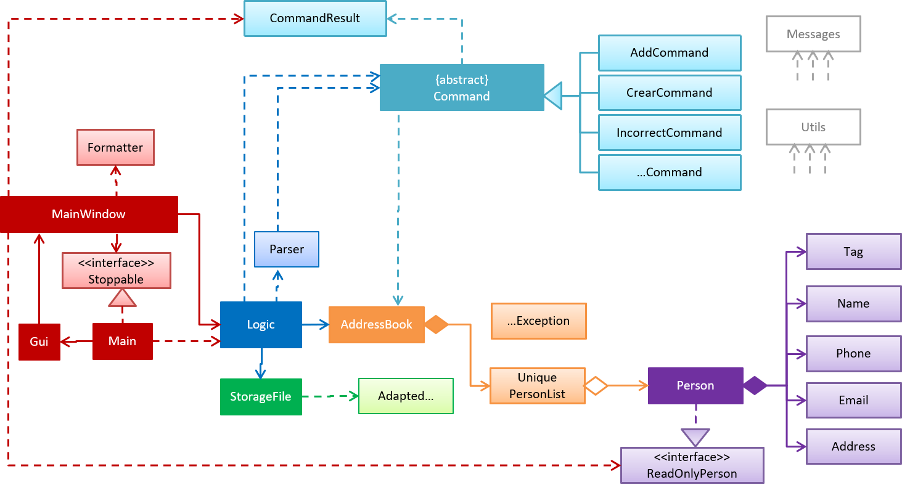

# Developer Guide

* [Setting Up](#setting-up)
* [Design](#design)
* [Testing](#testing)
* [Appendix A: User Stories](#appendix-a--user-stories)
* [Appendix B: Use Cases](#appendix-b--use-cases)
* [Appendix C: Non Functional Requirements](#appendix-c--non-functional-requirements)
* [Appendix D: Gloassary](#appendix-d--glossary)

## Setting up

#### Prerequisites

* JDK 8 or later
* IntelliJ IDE

#### Importing the project into IntelliJ

1. Open IntelliJ (if you are not in the welcome screen, click `File` > `Close Project` to close the existing project dialog first)
2. Set up the correct JDK version
   1. Click `Configure` > `Project Defaults` > `Project Structure`
   2. If JDK 8 is listed in the drop down, select it. If it is not, click `New...` and select the directory where you installed JDK 8.
   3. Click `OK`.
3. Click `Import Project`
4. Locate the project directory and click `OK`
5. Select `Create project from existing sources` and click `Next`
6. Rename the project if you want. Click `Next`
7. Ensure that your `\src` and `\test\java` folder is checked. Keep clicking `Next`
8. Click `Finish`
9. Add JUnit 4 to classpath
   1. Open any test file in `\test\java` and place your cursor over any `@Test` highlighted in red
   2. Press <kbd>ALT</kbd>+<kbd>ENTER</kbd> and select `Add 'JUnit4' to classpath`
   3. Select `Use 'JUnit4' from IntelliJ IDEA distribution` and click `OK`
10. Run all the tests (right-click the `test` folder, and click `Run 'All Tests'`)
11. Observe how some tests fail. That is because they try to access the test data from the wrong directory (the working directory is expected to be the root directory, but IntelliJ runs the test with `test\` as the working directory by default). To fix this issue:
    1. Go to `Run` -> `Edit Configurations...`
    2. On the list at the left, expand `JUnit`, and remove all the test configurations (e.g. `All in test`) by selecting it and clicking on the '-' icon at the top of the list
    3. Expand `Defaults`, and ensure that `JUnit` is selected
    4. Under `Configuration`, change the `Working directory` to the `addressbook-level3` folder
    5. Click `OK`
12. Run the tests again to ensure they all pass now.

## Design

## Testing

* In IntelliJ, right-click on the `test` folder and choose `Run 'All Tests'`

## Appendix A : User Stories

Priorities: High (must have) - `* * *`, Medium (nice to have)  - `* *`,  Low (unlikely to have) - `*`

Priority | As a ... | I want to ... | So that I can...
-------- | :-------- | :--------- | :-----------
`* * *` | new user | see usage instructions | refer to instructions when I forget how to use the App
`* * *` | user | add a new person |
`* * *` | user | delete a person | remove entries that I no longer need
`* * *` | user | find a person by name | locate details of persons without having to go through the entire list
`* *` | user | hide [private contact details](#private-contact-detail) by default | minimize chance of someone else seeing them by accident
`*` | user with many persons in the address book | sort persons by name | locate a person easily

## Appendix B : Use Cases

(For all use cases below, the **System** is the `AddressBook` and the **Actor** is the `user`, unless specified otherwise)

#### Use case: Delete person

**MSS**

1. User requests to list persons
2. AddressBook shows a list of persons
3. User requests to delete a specific person in the list
4. AddressBook deletes the person  
Use case ends.

**Extensions**

2a. The list is empty

> Use case ends

3a. The given index is invalid

> 3a1. AddressBook shows an error message  
  Use case resumes at step 2

## Appendix C : Non Functional Requirements

1. Should work on any [mainstream OS](#mainstream-os) as long as it has Java 8 or higher installed.
2. Should be able to hold up to 1000 persons.
3. Should come with automated unit tests and open source code.
4. Should favor DOS style commands over Unix-style commands.

## Appendix D : Glossary

##### Mainstream OS

> Windows, Linux, Unix, OS-X

##### Private contact detail

> A contact detail that is not meant to be shared with others
